# ARCADIA ZOO  ECF Développeur web et web mobile

Site vitrine du site Arcadia Zoo.

Comment avez-vous mis en place votre environnement de travail ? Justifiez vos choix.

## 1. Manuel d'utilisation

### 1.1. Présentation de l'application

Effectuez un résumé du projet en français d’une longueur d’environ 20 lignes soit 200 à 250 mots

### 1.2. Identifiants de démo

| IDENTIFIANT           | MOT DE PASSE | ROLE        |
|-----------------------|--------------|-------------|
| <admin@test.fr>       | admin        | ADMIN       |
| <employe@test.fr>     | employe      | EMPLOYE     |
| <veterinaire@test.fr> | veterinaire  | VETERINAIRE |

### 1.3. Installation du Backend

Clonez l'application sur votre poste de travail

```bash
git clone https://github.com/brunoturpeau/arcadia_backend.git
```

Installez les dépendances

```bash
cd arcadiazoo_backend
composer install
npm install
```

Compilez les fichiers Tailwind

```bash
php bin/console tailwind:build
```

Créez un fichier .env.local

```bash
cp .env .env.local
```

Modifier la constante DATABASE_URL

```bash
DATABASE_URL="mysql://root:@127.0.0.1:3306/sf_arcadia_backend?serverVersion=8.0.32&charset=utf8mb4"
```

Créez la base de données et les tables

```bash
php bin/console console d:d:c
php bin/console console make:migration
php bin/console console d:m:m
```

Créez un jeu de données test

```bash
php bin/console doctrine:fixtures:load
```

### 1.4. Installation du Frontend

## 2. Gestion de projet

### 2.1. Plateforme de gestion de projet

JIRA

### 2.2. Méthode

AGILE

### 2.3. Workflow

- **Backlog** Recense toutes les fonctionnalités prévues classées par priorité
- **Planning** Fonctionnalités en préparations
- **En cours** Fonctionnalités en cours de developpement
- **Révision (dev)** Fonctionnalités terminées (sur la branche de développement)
- **Terminé (main)** Fonctionnalités qui ont été merge dans la branche principale

### 2.4. Tickets

- Les fonctionnalités sont représentées sous forme de **User Story**
- Les autres actions a mener sont représentées sous forme de **Task**
- ... sous forme d'**Epic**

### 2.5. User story

### 2.6. Sprints

## 3. Conception graphique

### 3.1. Brief créatif

Le graphisme du site doit retranscrire les valeurs écologiques du zoo.

### 3.2. Charte graphique

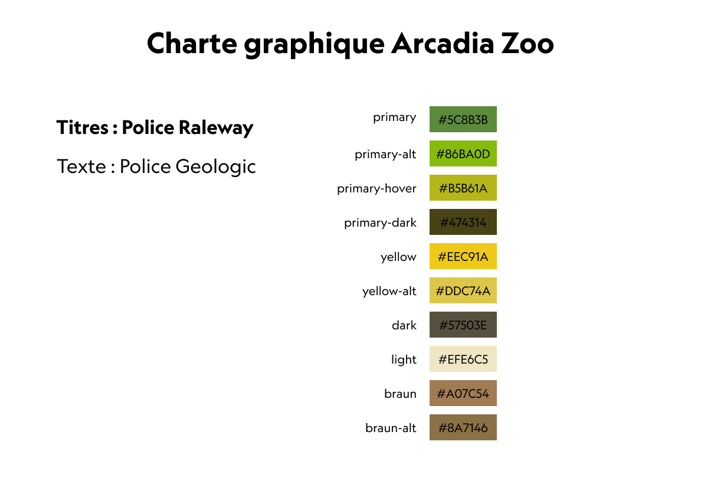

### 3.3. Wireframes

#### 3.3.1. Mobile

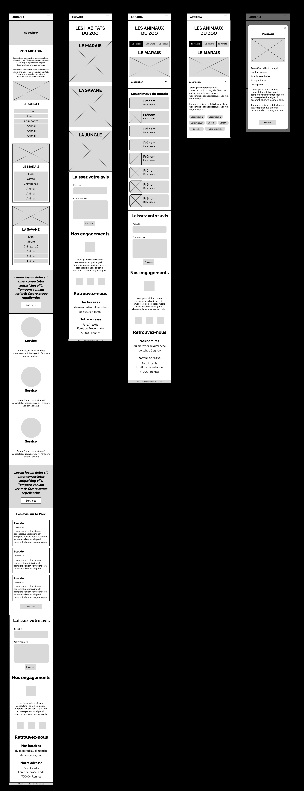

#### 3.3.2 Home Desktop

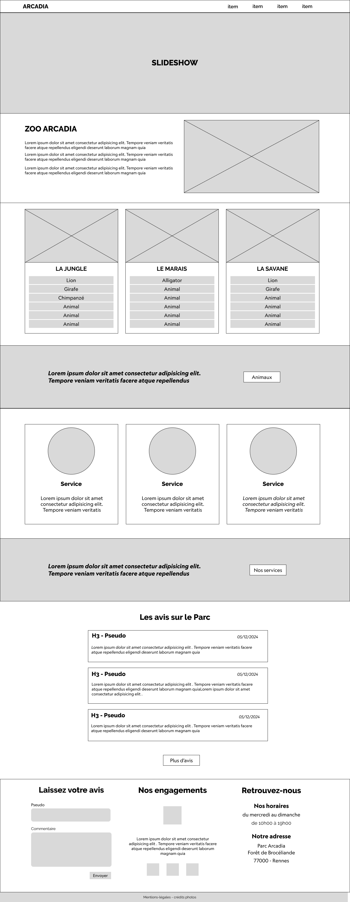

#### 3.3.3 Habitats Desktop

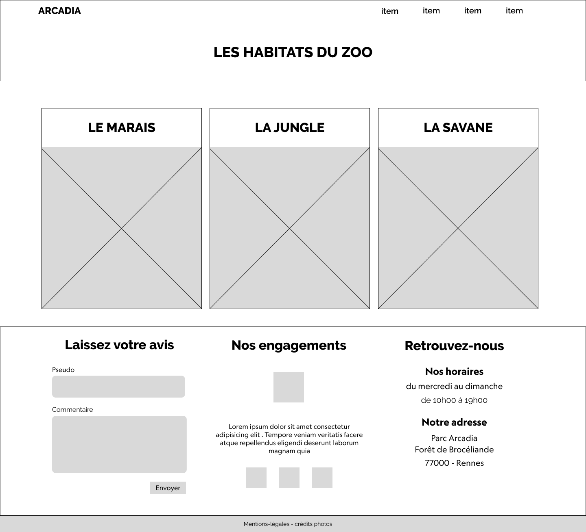

#### 3.3.4 Animaux Desktop

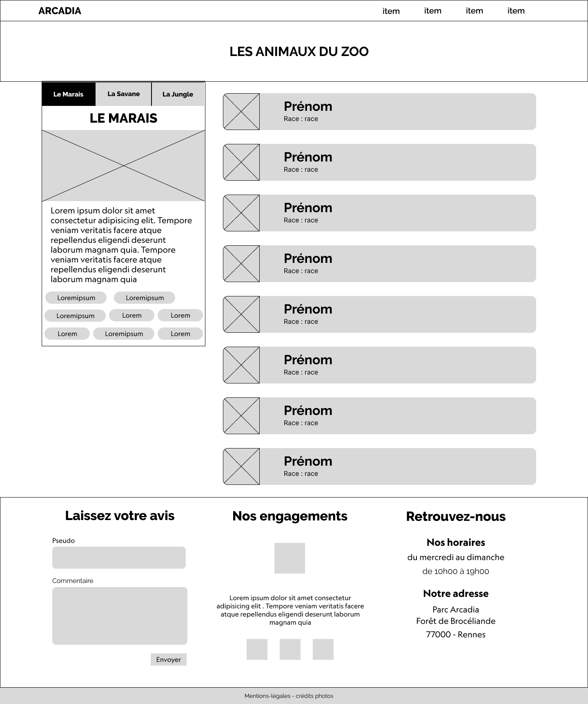

#### 3.3.5 Animaux Détail Desktop


### 3.4. Mockup

#### 3.4.1. Accueil Desktop

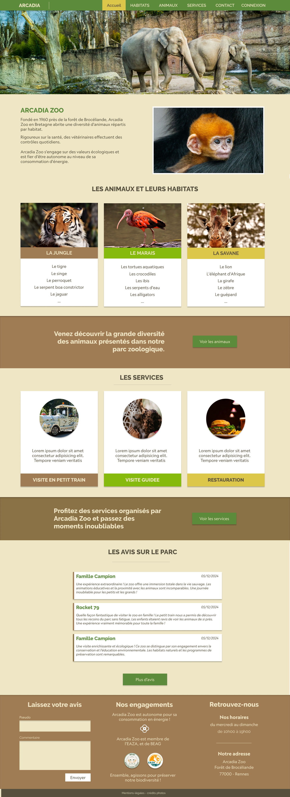

#### 3.4.2. Habitats Desktop

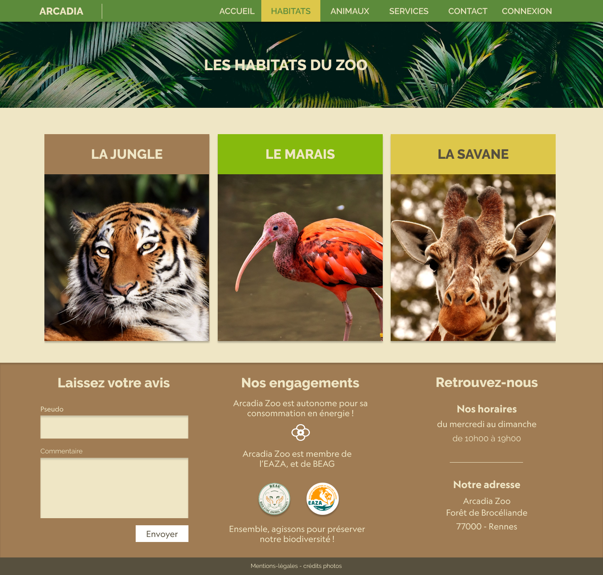

#### 3.4.3. Animaux Desktop

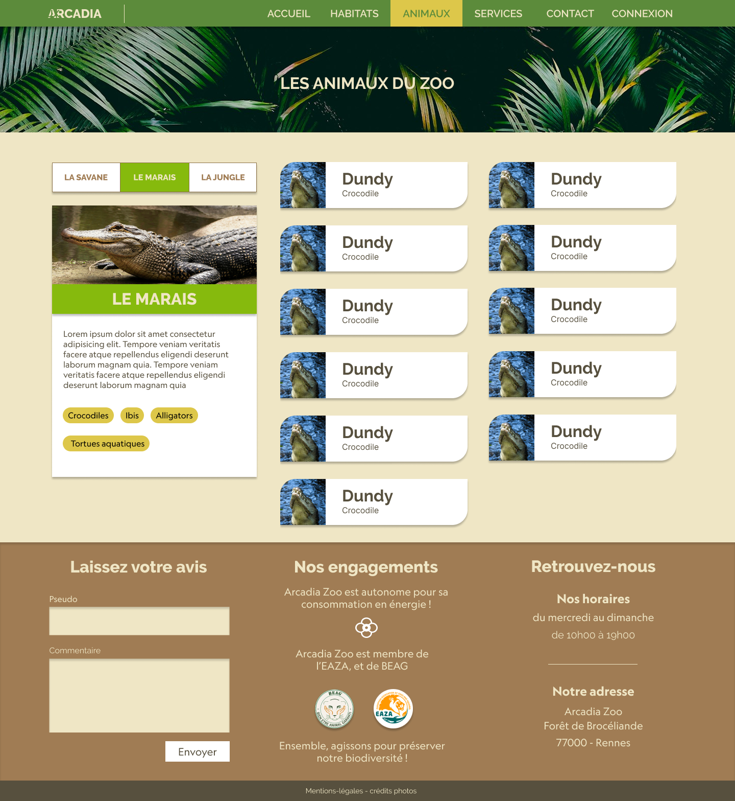

#### 3.4.5. Animaux Détail Mobile

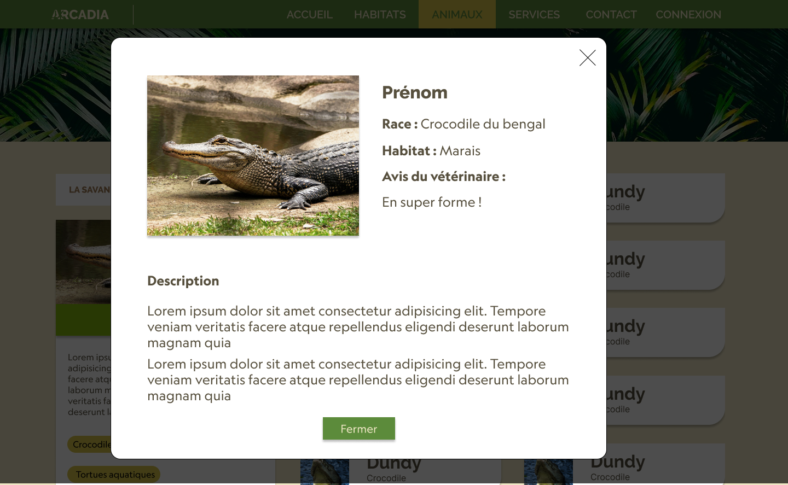

#### 6.4.6. Mockup mobile

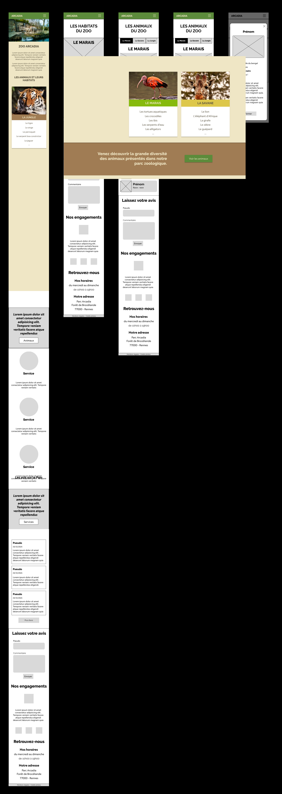

## 4. Spécifications fonctionnelles

### 4.1. Arborescence du projet

- Accueil
- Habitats
- Services
- Contact
- Mentions légales
- Connexion/Déconnexion

### 4.2. Fonctionnalités frontend

- Formulaire de contact
- Laisser un avis

### 4.3. Fonctionnalités backend

- [Administrateur] - Gérer les services
- [Administrateur] - Gérer les habitats
- [Administrateur] - Gérer les animaux
- [Administrateur] - Gérer les horaires
- [Administrateur] - Gérer les comptes utilisateurs
- [Administrateur] - Voir les statistiques popularité animaux

- [Employe] - Gérer les avis
- [Employe] - Gérer la nourriture donnée aux animaux
- [Employe] - Modifier les services

- [Veterinaire] - Gérer les comptes-rendu vétérinaire
- [Veterinaire] - Gérer les commentaires sur les habitats

## 5. Documentation technique

> Spécifiez les technologies que vous avez utilisé en justifiant les conditions d’utilisation et pourquoi le choix de ses éléments

Énumérez les mécanismes de sécurité que vous avez mis en place, aussi bien sur vos formulaires que sur les composants front-end ainsi que back-end.  

Décrivez une veille technologique que vous avez effectuée, sur les vulnérabilités de sécurité.

### 5.1. Choix technologiques

> L'interface utilisateur communique avec la base de donnés par l'intermédiaire dune API

#### 5.1.1. FRONTEND

- Next JS
- React
- TypeScript
- Tailwindcss

#### 5.1.2. BACKEND

- Symfony
- ApiPlatform
- Tailwindcss
- Flowbite

### 5.2. Diagramme d’utilisation

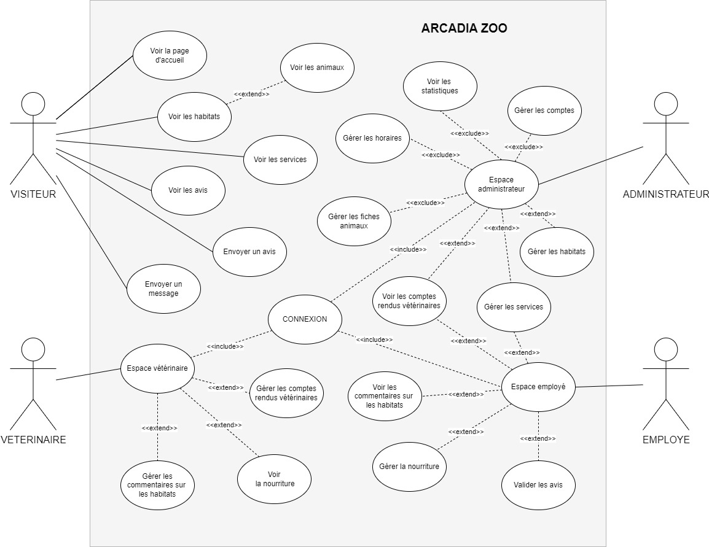

### 5.3. Composants de l'Interface Utilisateur

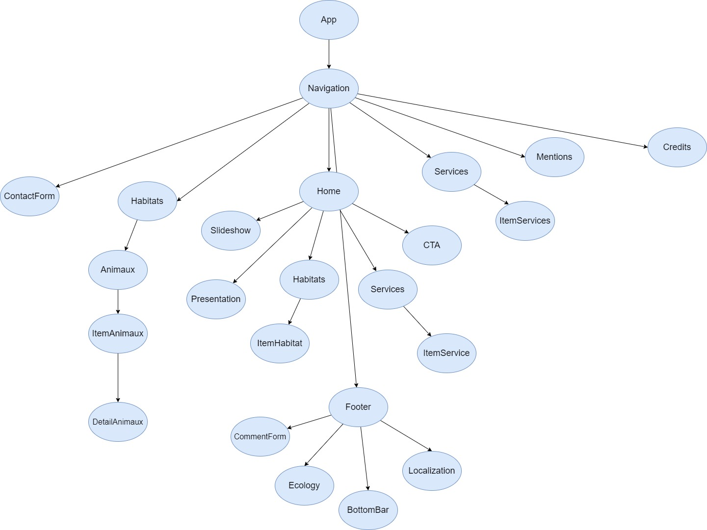

### 5.4. Accessibilité

#### 5.4.1. Compatibilité navigateur

Le site est compatible avec les navigateurs suivants :

- Internet Explorer
- Mozilla Firefox
- Google Chrome
- Safari
- Opéra

#### 5.4.2. Types d’appareils

Le site est conçu de manière dite “responsive” pour qu’il assure une navigation optimale sur tous types d’appareils :

- Téléphones mobiles
- Tablettes
- Ordinateurs portables
- Ordinateurs de bureau

### 5.5. Sécurité

L’accès aux comptes d’administration est limité aux 3 rôles suivants :

- ADMINISTRATEUR
- EMPLOYE
- VETERINAIRE

### 5.6. Modèle Conceptuel de Données

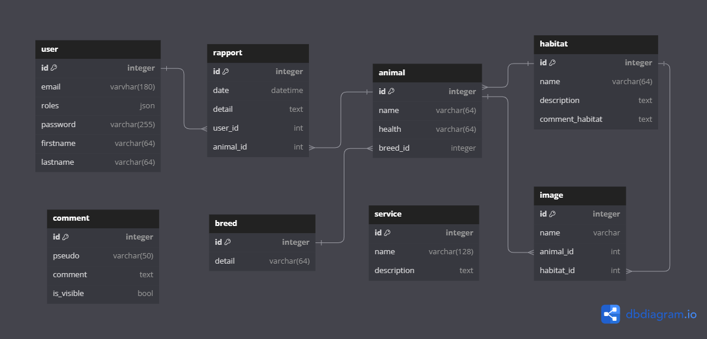

## 6. Recherche

> Décrivez une situation de travail ayant nécessité une recherche durant le projet à partir de site anglophone. N’oubliez pas de citer la source

Mentionnez l’extrait du site anglophone qui vous a aidé dans la question précédente en effectuant une traduction en français.
