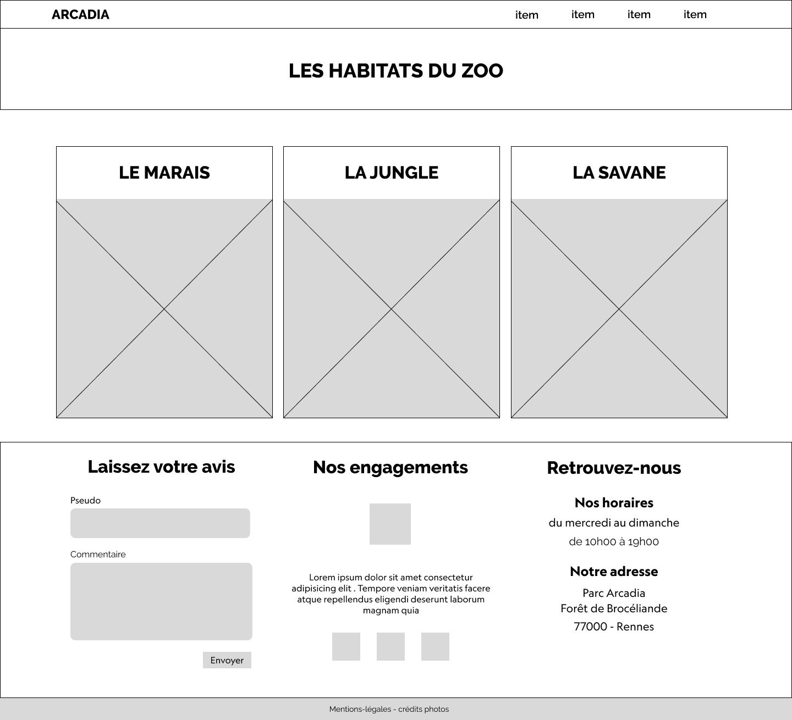

# Conception graphique

## Brief créatif

Le graphisme du site doit retranscrire les valeurs écologiques du zoo.

Design : flat

## Charte graphique

## Wireframes

### Mobile

### Home Desktop

### Habitats Desktop

### Animaux Desktop

### Animaux Détail Desktop

## Mockup

### Accueil Desktop

### Habitats Desktop

### Animaux Desktop

### Animaux Détail Mobile

### Mockup mobile

