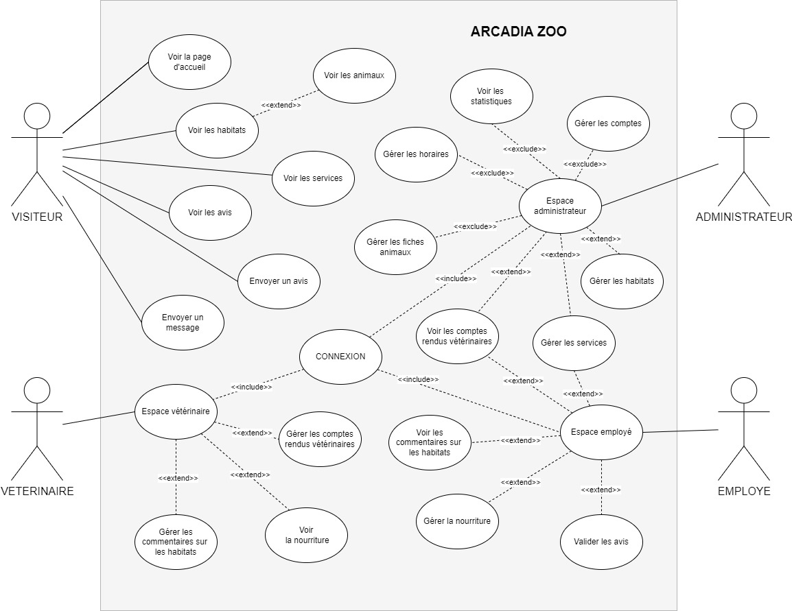
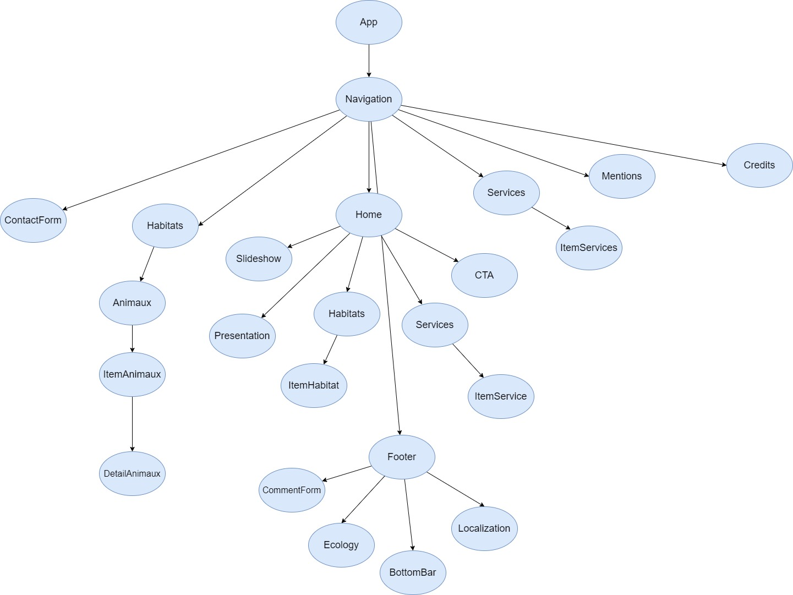
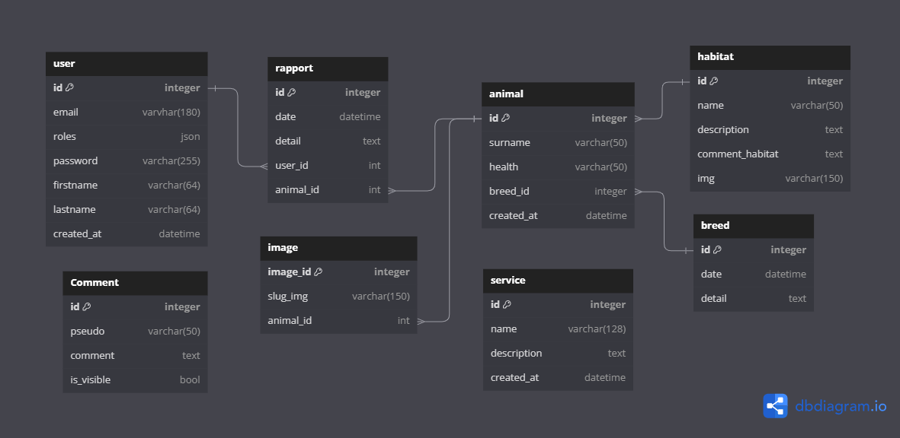

# Documentation technique

## Choix technologiques

> L'interface utilisateur communique avec la base de donnés par l'intermédiaire dune API

### FRONTEND

- Next JS
- React 
- TypeScript
- Tailwindcss
 
### BACKEND
- Symfony 
- ApiPlatform
- Tailwindcss
- Flowbite

## Diagramme d’utilisation

## Composants de l'Interface Utilisateur

## Accessibilité

### Compatibilité navigateur

Le site est compatible avec les navigateurs suivants :

- Internet Explorer
- Mozilla Firefox
- Google Chrome
- Safari
- Opéra

### Types d’appareils

Le site est conçu de manière dite “responsive” pour qu’il assure une navigation optimale sur tous types d’appareils :

- Téléphones mobiles
- Tablettes
- Ordinateurs portables
- Ordinateurs de bureau

## Sécurité

L’accès aux comptes d’administration est limité aux 3 rôles suivants :

- ADMINISTRATEUR
- EMPLOYE
- VETERINAIRE

## Modèle Conceptuel de Données

